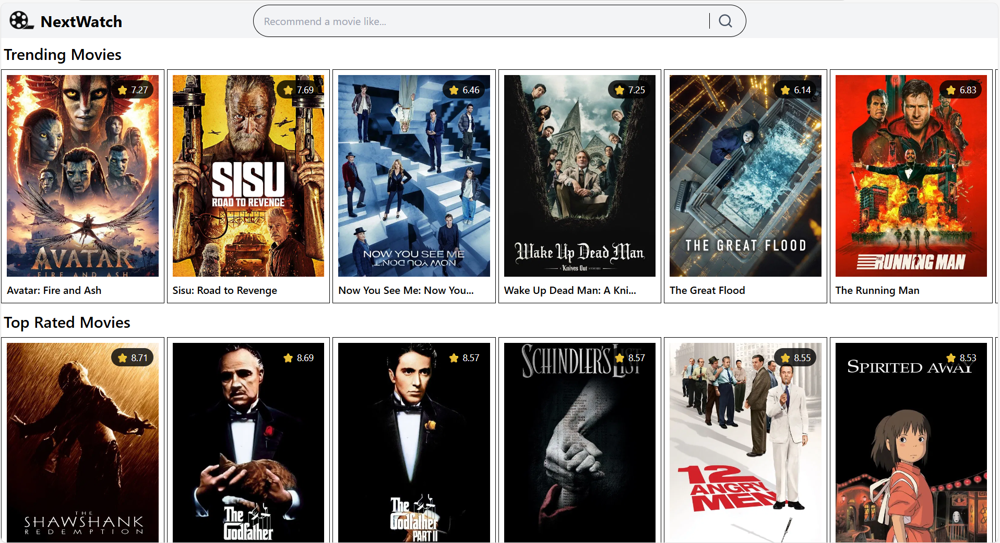
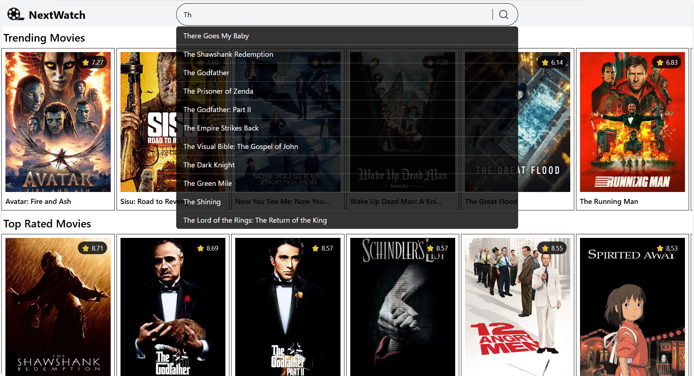
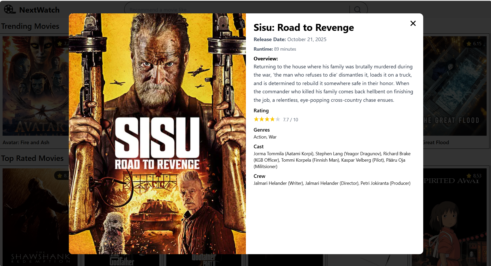
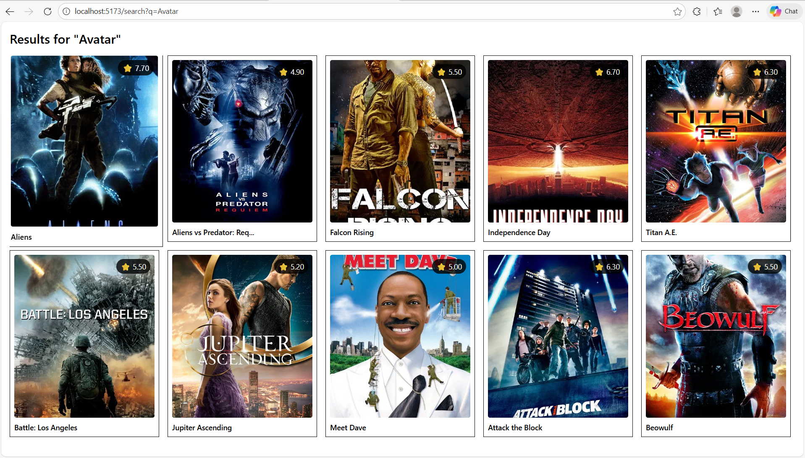

# NextWatch — Movie Recommendation System

NextWatch is a movie recommendation platform that combines Machine Learning, FastAPI, and a modern React UI to deliver personalized movie recommendations.
It supports both dataset-based recommendations and real-time recommendations for movies not present in the dataset using TMDB enrichment.

## 🚀 Key Features

### 🔍 Smart Movie Recommendation

- Recommends movies using content-based filtering
- Uses cosine similarity on vectorized movie tags
- Handles both Known movies (present in dataset) and External movies (fetched from TMDB and vectorized on the fly)

### ⚡ High Performance Backend

- Built with FastAPI
- In-memory caching with TTL
- CSV + TMDB hybrid data strategy to reduce API calls

### 🎨 Frontend & User Experience

- Modern, responsive React UI, fully optimized for mobile and desktop
- Smart search experience with autocomplete suggestions, debounced input handling, and a results page
- Real-time movie discovery featuring Trending, Popular, and Top-Rated movies

## 🏗️ Tech Stack

### Backend

- FastAPI
- Pandas
- NumPy
- Scikit-learn
- NLTK
- Joblib
- Requests

### Frontend

- React (Vite)
- Tailwind CSS
- React Router
- React Hot Toast
- React Icons

### External API

- TMDB (The Movie Database)

## 🧠 Machine Learning Workflow

1️⃣ Data Loading & Feature Selection<br>
2️⃣ Data Cleaning & Normalization<br>
3️⃣ Feature Engineering (Tag Construction)<br>
4️⃣ Text Preprocessing using NLTK (Porter Stemming)<br>
5️⃣ Vectorization using CountVectorizer<br>
6️⃣ Similarity Computation using Cosine Similarity<br>
7️⃣ Recommendation Generation by Selecting Top-K Similar Movies

## 📷 Screenshots

<table>
  <tr>
    <td>
      
    </td>
    <td>
      
    </td>
  </tr>
  <tr>
    <td>
      
    </td>
    <td>
      
    </td>
  </tr>
</table>


## 📂 Project Structure

``` 
Movie-Recommendation-System/
│
├── backend/
│   ├── app.py               
│   ├── recommender.py          
│   ├── requirements.txt
│   ├── .env
│   └── data/
│       ├── movies_final.csv
│       ├── tmdb_combined_with_trending.csv
│       ├── movie_vectors.npz
│       └── vectorizer.pkl
│
├── frontend/
│   ├── src/
│   │   ├── components/
│   │   ├── App.tsx
│   │   ├── App.css
│   │   └── assets/
│   ├── .env
│   └── vite.config.ts
│
└── README.md
```

## 🔧 Installation & Setup
### Clone the Repository

```bash
git clone https://github.com/Kunalgarg108/Movie-Recommendation-System.git
cd Movie-Recommendation-System
```

### Backend Setup
```
.env
TMDB_API_KEY=...
```

```bash
cd backend
python -m venv myenv
source venv/bin/activate   # Linux / Mac
venv\Scripts\activate      # Windows
pip install -r requirements.txt
uvicorn app:app --reload
```

### Frontend Setup
```
.env
VITE_BACKEND_URL=...
```

```bash
cd frontend
npm install
npm run dev
```
